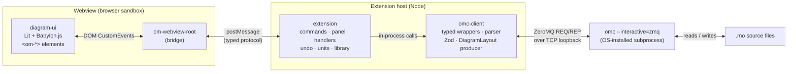

# Modelica VSCode Extension

A graphical model editor and simulation runner for Modelica, delivered as a VSCode
extension. Backed by [OpenModelica](https://openmodelica.org/) (OMC) for
compilation, model introspection, and simulation.

You browse a Modelica library in a tree, open a class as a **diagram**, drag in
components, draw connections, edit parameters in a side panel (with live unit
conversion), run a semantic check or a simulation — and every gesture is written
straight back into the `.mo` source through OMC's scripting API.

> **Status:** active development. The diagram editor, parameter panels, unit
> handling, snapshot undo, library browser, REPL, and check/simulate flows are
> implemented end-to-end against a pinned OMC. See the per-package coverage and
> the [roadmap](#roadmap) below.

---

## What it is (and isn't)

This is **pure TypeScript**, top to bottom — there is **no Rust/Go backend, no
separate server process, and no JSON-RPC layer**. The "backend" is the VSCode
extension host (Node) itself; it talks to a single `omc` subprocess over ZeroMQ.



The four communication legs, end to end:

| Leg | Between | Transport | Defined in |
| --- | --- | --- | --- |
| 1 | `diagram-ui` ↔ webview bridge | DOM `CustomEvent`s (`om-*`) | [`diagram-ui`](packages/diagram-ui) |
| 2 | webview ↔ extension host | `postMessage` (typed tagged union) | [protocol.ts](packages/extension/src/webview/protocol.ts) |
| 3 | extension host ↔ `omc-client` | in-process TypeScript calls | [`omc-client`](packages/omc-client) |
| 4 | `omc-client` ↔ `omc` | ZeroMQ REQ/REP, Modelica-syntax wire format | [transport.ts](packages/omc-client/src/transport.ts) |

There is **no Modelica compiler, DAE solver, or annotation evaluator written
here** — OMC does all of that. We write the typed client, the parser for OMC's
responses, the diagram renderer, and the editor UI.

---

## Packages

A pnpm workspace ([`pnpm-workspace.yaml`](pnpm-workspace.yaml)) of six packages:

| Package | Role |
| --- | --- |
| [`@dicode/omc-client`](packages/omc-client) | TypeScript client for OMC's interactive ZeroMQ scripting API. Spawns `omc`, parses its Modelica-syntax responses into a typed AST, exposes ~200 Zod-validated typed wrappers across 11 categories, and turns `getModelInstance` into a renderer-agnostic `DiagramLayout`. No VSCode dependency. |
| [`@dicode/diagram-svg`](packages/diagram-svg) | Pure function: typed `IconLayer[]` → self-contained `<svg>` string. Renders all six Modelica shape primitives. Used for library thumbnails and as the source for Babylon icon textures. |
| [`@dicode/ui-common`](packages/ui-common) | Shared UI foundation for the `<om-*>` webviews: the `--om-*` design tokens and the Web Awesome → VSCode theme bridge. No Babylon, no OMC — so both `diagram-ui` and `result-ui` reuse it without inheriting each other's weight. |
| [`@dicode/diagram-ui`](packages/diagram-ui) | Lit + Babylon.js custom elements (`<om-*>`) — the interactive graphical editor that runs inside the webview. Renders the `DiagramLayout`, handles picking/selection/drag, and the parameter side-panel. Talks to the host only through DOM events. |
| [`@dicode/result-ui`](packages/result-ui) | Standalone Lit + ECharts custom elements (`<om-*>`) for the postprocessing / results view — `.mat` results overlaid on plot cards. Deliberately independent of `diagram-ui` (no Babylon) so it can be distributed on its own. Pre-implementation; see the [design note](docs/postprocessing-design.md). |
| [`modelica-wrapper`](packages/extension) (the extension) | The VSCode extension host. Owns the `OmcClient` lifecycle, the diagram webview panel, the message protocol, every mutation handler, snapshot undo, display-unit conversion, the library data source, the REPL, and the check/simulate commands. |

Dependency direction (as shipped): `extension` → `diagram-ui` / `diagram-svg` /
`omc-client` / `ui-common`; `diagram-ui` → `diagram-svg` / `omc-client` / `ui-common`;
`diagram-svg` → `omc-client`. `ui-common`, `omc-client`, and `result-ui` depend on
nothing in the workspace. As the postprocessing view lands, `result-ui` will take
`ui-common`, and `extension` will take `result-ui`.

---

## Documentation

The root file is the map; the detail lives under [`docs/`](docs):

- **[Architecture](docs/architecture.md)** — the four-layer design, the
  webview/host split, data flow, and the persistence/undo model.
- **[Communication protocol](docs/protocol.md)** — the complete
  extension ↔ webview message catalog (both directions), the library
  request/response correlation, and sequence diagrams.
- **[Parameter panel — deep dive](docs/parameter-panel.md)** — exactly what
  happens when you open and edit a parameter panel: the information flow, every
  OMC call made, in order, for component params, class params, simulate, unit
  conversion, reset-to-defaults, and `Dialog.enable`.
- **[Diagram rendering](docs/diagram-rendering.md)** — `getModelInstance` →
  `DiagramLayout` → Babylon scene / SVG, icon layering, and picking.
- **[OMC client internals](docs/omc-client.md)** — transport, subprocess
  spawning, the response parser, the expression evaluator, the typed API,
  Zod validation, and version pinning.
- **[Parameter model — design](docs/parameter-model-design.md)** — planned
  refactor: a pure `produceParameterModel` producer over `getModelInstance`,
  shared by the parameter form and the diagram value-labels (pre-implementation).
- **[MultiBody 3D preview — design](docs/multibody-preview-design.md)** —
  design note for the t=0 spatial preview (pre-implementation).
- **[Postprocessing view — design](docs/postprocessing-design.md)** — a second
  webview that collects `.mat` result files (from any model) and overlays their
  trajectories on plot cards (pre-implementation).
- **[Language features — design](docs/language-features-design.md)** —
  go-to-definition, hover, autocomplete, and outline for `.mo` source.
- **[OMEdit autocomplete — reference](docs/omedit-completion-reference.md)** —
  how the upstream OMEdit completer routes and sources candidates (library-tree,
  not live OMC), and where our provider diverges.
- **[Diagram & library tree — OMC/OMEdit reference](docs/diagram-omc-reference.md)** —
  the normative coordinate/annotation/connection semantics + the OMC calls
  OMEdit uses, mapped against our implementation, with a diagram-editor gaps
  table.

---

## Development

### Devcontainer (recommended)

Open the repo in VSCode and accept the "Reopen in Container" prompt. The
container ([`.devcontainer/Dockerfile`](.devcontainer/Dockerfile)) is built on
`openmodelica/openmodelica:vX.Y.Z-minimal` with Node 20 + pnpm preinstalled.
`omc` is on PATH at `/usr/bin/omc`, so the integration tests run out of the box.

The OMC version is **pinned in three places** that Renovate keeps in lock-step:

- [`.devcontainer/Dockerfile`](.devcontainer/Dockerfile) — `FROM openmodelica/openmodelica:vX.Y.Z-minimal`
- [`.github/workflows/ci.yml`](.github/workflows/ci.yml) — same image in the integration matrix
- [`packages/omc-client/src/version.ts`](packages/omc-client/src/version.ts) — `SUPPORTED_OMC.primary` (currently `1.26.7`), exposed at runtime via `OmcClient.getVersionStatus()`

### Local dev without the container

```sh
# Pin OMC to whatever the package targets:
omc --version  # should match packages/omc-client/src/version.ts SUPPORTED_OMC.primary

pnpm install
pnpm -r typecheck
pnpm -r test          # runs unit + integration when omc is on PATH
```

The webview bundle has no watcher by default — after editing `diagram-ui` or the
webview entry, run `pnpm build` (or `pnpm watch`) in the relevant package and
reload the VSCode window, or the panel keeps serving the old bundle.

### CI

[`.github/workflows/ci.yml`](.github/workflows/ci.yml) runs on every push and PR:

1. **Lint + unit** — typecheck, the parser/version/registry unit tests, and the
   `omc-client` `coverage:recount` drift check, on plain `ubuntu-latest`.
2. **Integration (OMC matrix)** — inside the pinned `openmodelica/openmodelica`
   container, runs the full integration suite + builds the extension bundle.

[`.github/workflows/omc-update-audit.yml`](.github/workflows/omc-update-audit.yml)
runs on PRs labeled `omc-update` (Renovate adds the label when bumping OMC). It
runs the integration suite + the wrapper drift-probe against the *new* OMC and
posts a checklist pointing back to [`packages/omc-client/docs/audit.md`](packages/omc-client/docs/audit.md).

### Renovate

[`renovate.json`](renovate.json):

- **Groups OMC bumps** across the Dockerfile, CI workflow, and `version.ts` into
  a single PR labeled `omc-update`.
- Tracks `openmodelica/openmodelica` Docker Hub tags and OpenModelica GitHub
  releases (the latter via a regex `customManager` keyed off `SUPPORTED_OMC.primary`).
- Auto-merges dev-dependency patches; **never** auto-merges OMC bumps — the audit
  checklist gets walked first.

---

## OMC API coverage

`omc-client` wraps ~200 OMC scripting functions, tracked function-by-function
against a real OMC:

- **[Coverage tracker](packages/omc-client/docs/coverage.md)** — which wrappers
  are integration-verified on the pinned OMC, which are cheap-but-unverified,
  and which are broken on the pin (with reasons). Kept honest by the
  `coverage:recount` CI check.
- **[Audit runbook](packages/omc-client/docs/audit.md)** — the read-only
  procedure for re-auditing the wrappers against upstream OMC docs whenever the
  pin is bumped. Run it as: *"audit the omc-client package using
  `packages/omc-client/docs/audit.md`."*

---

## Roadmap

- **Done / working** — read-only browsing; diagram + icon rendering from parsed
  annotations; drag-to-place (`addComponent`); draw/delete connections; component
  & class parameter editing with inherited-modifier routing; live display-unit
  conversion + unit dropdowns; conditional component/port gating; diagram-local
  snapshot undo; reset-to-defaults; semantic `checkModel` with diagnostics;
  simulate with results post-processing; library tree + search with lazy icon
  thumbnails; a Modelica REPL terminal.
- **In progress / next** — MultiBody 3D preview (see
  [design note](docs/multibody-preview-design.md)); FMU export via
  `buildModelFMU`; broader OMC coverage toward the
  [100% coverage epic](packages/omc-client/docs/coverage.md).
- **Later** — OMSimulator / SSP composition; full undo/redo history;
  cross-platform packaging; bundling decisions for OMC.

---

## References

**Authoritative — read these before reverse-engineering anything:**

- **OpenModelica.Scripting API reference** — every function's return type as a
  Modelica signature: <https://build.openmodelica.org/Documentation/OpenModelica.Scripting.html>
- **Modelica specification ch. 18 — Annotations** (§18.6 lists the exact
  positional-argument order for every shape primitive): <https://specification.modelica.org/maint/3.6/annotations.html>

**Reference implementations (parser/client cross-checks):**

- **OMPython** (de-facto reference parser, `OMTypedParser.py`): <https://github.com/OpenModelica/OMPython>
- **OMJulia.jl** (second perspective on parser behavior): <https://github.com/OpenModelica/OMJulia.jl>
- **OMEdit** (the reference graphical editor we learn UI flows from; do **not**
  copy `StringHandler::getStrings()`): <https://github.com/OpenModelica/OMEdit>

**Project / ecosystem:**

- OpenModelica: <https://github.com/OpenModelica/OpenModelica>
- FMI standard: <https://fmi-standard.org/>
- OMSimulator: <https://github.com/OpenModelica/OMSimulator>

---

## Acknowledgements

Modelica syntax highlighting is provided by the TextMate grammar from
[**SimplyDanny/modelica-language-vscode**](https://github.com/SimplyDanny/modelica-language-vscode)
by **SimplyDanny** (Danny Moesch), reused under the MIT License. Thank you. The
vendored grammar and its license live in
[`packages/extension/syntaxes/`](packages/extension/syntaxes/).
