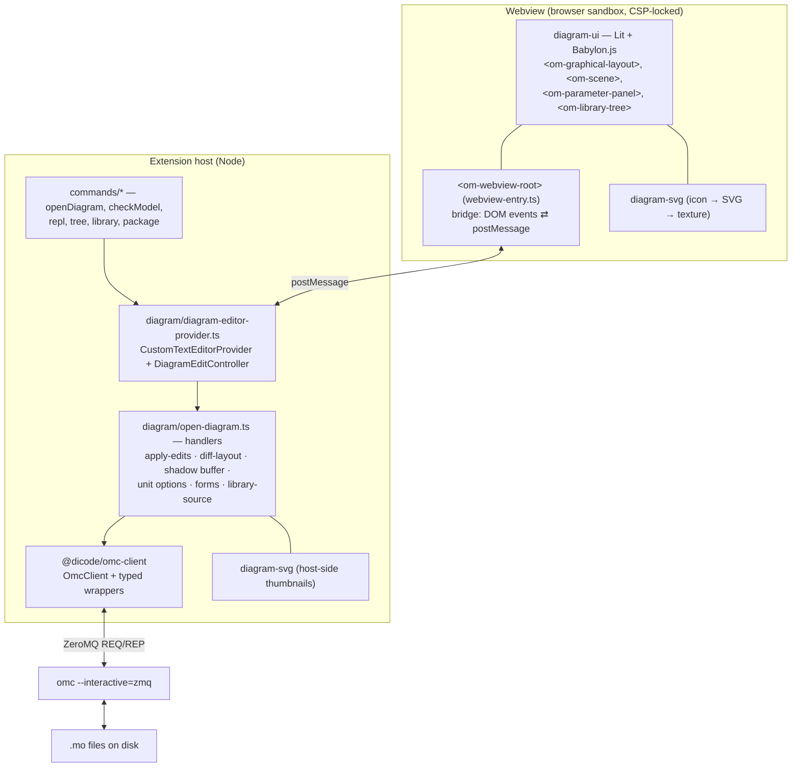
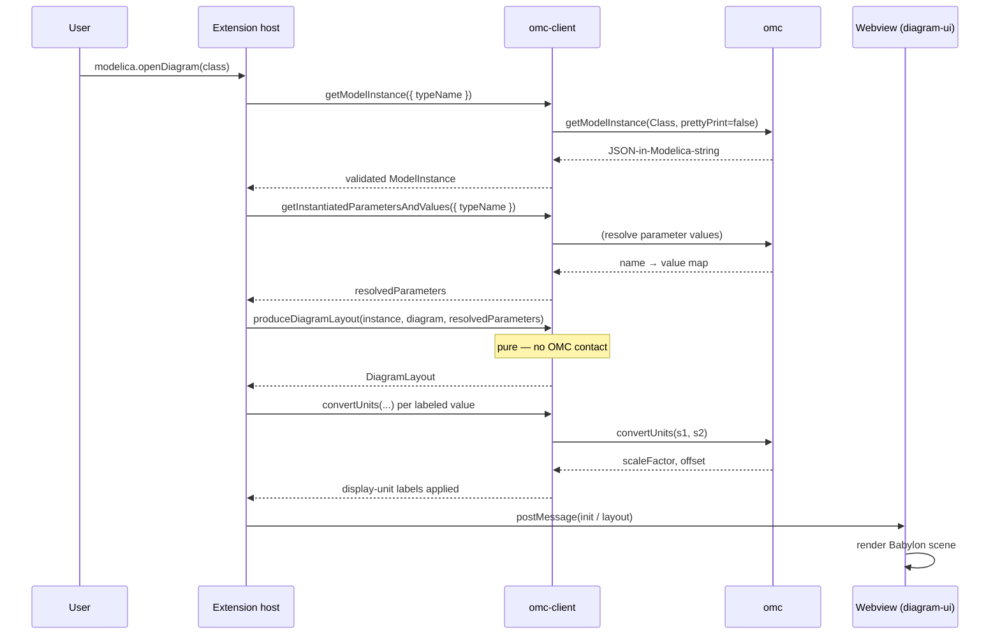
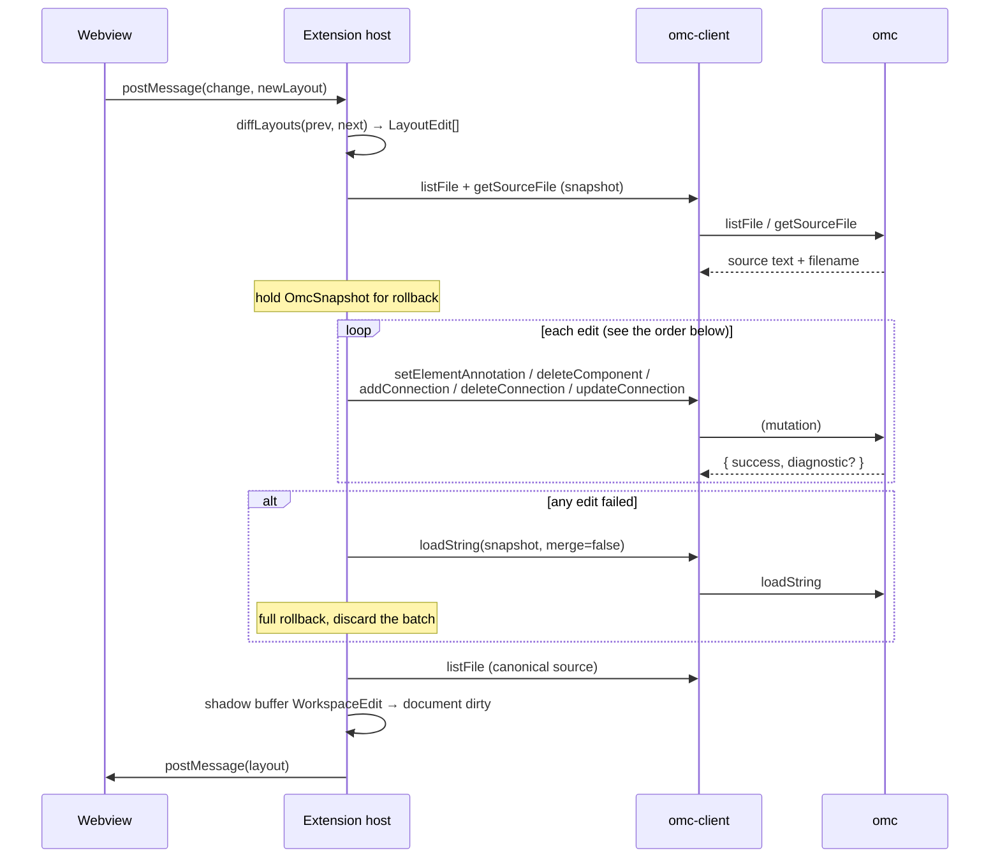

# Architecture

[← back to README](../README.md)

This document describes the overall design: the layers, the webview/host split,
how data flows for a read and for an edit, and the persistence/undo model. For
the exact message catalog see [protocol.md](protocol.md); for the parameter-panel
information flow see [parameter-panel.md](parameter-panel.md).

## The big picture

The system is pure TypeScript in a pnpm monorepo. There is **no separate backend
process**: the VSCode extension host *is* the backend. It links the `omc-client`
library directly and drives a single long-lived `omc` subprocess over ZeroMQ. The
interactive editor runs in a sandboxed webview and communicates with the host
only by `postMessage`.

## The four layers

### 1. `omc-client` — the typed OMC client

A standalone, VSCode-free TypeScript library. It owns everything about talking to
OMC:

- **Transport & process** — spawns `omc --interactive=zmq`, discovers its ZeroMQ
  endpoint via a deterministic port file, and runs a REQ/REP request loop behind
  a promise-chain mutex (OMC is single-threaded).
- **Parser** — OMC answers in *Modelica syntax*, not JSON. A recursive-descent
  parser turns each response into a tagged-union `Value` tree.
- **Eval** — an expression evaluator resolves `Dialog.enable` conditions,
  conditional declarations, and array-dimension expressions against live values.
- **Typed API** — ~200 wrappers across 11 categories (`browsing`, `contents`,
  `diagram`, `editing`, `elements`, `execution`, `library`, `lifecycle`,
  `parameters`, `results`, `solver`), each Zod-validated.
- **DiagramLayout producer** — a pure function that turns a `getModelInstance`
  AST into the renderer-agnostic `DiagramLayout`.

Full detail: [omc-client.md](omc-client.md).

### 2. `extension` — the host

The VSCode extension. It is the only layer that knows about both OMC and the UI,
and it is where all the orchestration lives:

- **Activation & commands** — activates on `workspaceContains:**/*.mo`; registers
  `modelica.openDiagram`, `modelica.checkModel`, `modelica.openRepl`, the library
  tree commands, etc. ([commands/](../packages/extension/src/commands))
- **OmcClient lifecycle** — created lazily on first use, `cd`'d into a per-
  workspace cache dir, disposed on deactivate.
- **Diagram editor** — `DiagramEditorProvider`
  ([diagram-editor-provider.ts](../packages/extension/src/diagram/diagram-editor-provider.ts))
  is a `CustomTextEditorProvider` bound to `*.mo`. It renders the CSP-locked HTML
  and hands each inbound message to a `DiagramEditController`, which serializes
  every gesture through one queue — OMC's socket admits one call at a time.
- **Handlers** — [open-diagram.ts](../packages/extension/src/diagram/open-diagram.ts)
  wires every gesture to the right `omc-client` calls: layout fetch, edit diffing
  and application, parameter forms, unit enrichment, the library data source.

### 3. `diagram-ui` — the editor (in the webview)

Lit custom elements (`<om-*>`) rendering into a Babylon.js scene. It is
**purposely host-agnostic**: it knows nothing about VSCode or OMC. It receives a
`DiagramLayout` as a property and emits DOM `CustomEvent`s for every user
gesture (move, connect, double-click, parameter submit, …). The
`<om-webview-root>` element in the *extension* package
([webview-entry.ts](../packages/extension/src/webview/webview-entry.ts)) is the
bridge that translates those DOM events to/from the `postMessage` protocol.

Full detail: [diagram-rendering.md](diagram-rendering.md).

### 4. `diagram-svg` — the icon renderer

A pure `IconLayer[] → <svg>` function. Used two ways: the host renders library
thumbnails with it (returned to the webview as SVG strings), and the webview
rasterizes its output into Babylon textures for component icons.

## Why this shape

| Decision | Rationale |
| --- | --- |
| TypeScript everywhere, no Rust/Go backend | One language, one toolchain, one test runner; the heavy lifting (compile, solve, flatten) is OMC's job, so a native backend bought nothing but FFI and packaging pain. Settled deliberately. |
| No separate server process / no JSON-RPC | The extension host is already a long-lived Node process; linking `omc-client` in-process removes a whole transport, its serialization, and its failure modes. |
| `omc` as a subprocess over ZeroMQ | OMC has no library form — it's a 100MB+ MetaModelica binary exposing only an RPC API. Subprocess + ZMQ is the supported integration. |
| `omc-client` has zero VSCode deps | It is unit-testable and integration-testable on its own (CI runs it against a real OMC), and reusable outside the extension. |
| `diagram-ui` talks only in DOM events | Keeps the renderer testable in Storybook with no VSCode, and keeps the host as the single owner of OMC state. |
| `getModelInstance` as the read path | One structured call returns the whole elaborated tree (inheritance already walked) instead of ~30 round-trips. See [memory and reference docs]. |
| Granular mutators as the write path | There is no "set whole AST" call; edits are applied as discrete `addComponent` / `updateComponent` / `setElementModifierValue` / `addConnection` calls, then the layout is re-read. |

## Read flow (opening a diagram)

The `DiagramLayout` is the single contract between host and webview. The webview
never sees a `ModelInstance` or makes an OMC call — it only ever renders a layout
and emits gestures.

## Write flow (a diagram edit)

Every mutation follows the same shape: **snapshot → apply granular edits →
re-read → push fresh layout → reflect the source into the buffer**.

Edits are **ordered** before applying, so dependent operations don't trip over
each other: connection deletes, component deletes, connection adds, placements,
then waypoints and vector-port re-indexes. Graphics edits come last and in their
own order — modifies, deletes, adds, reorders — because they address shapes by
positional index, and a delete shifts every index after it. The whole batch is
atomic: any failure restores the pre-batch snapshot.

## Persistence & undo model

OMC mutates an **in-memory AST**; the `.mo` file is not necessarily written until
something flushes it. The editor's `TextDocument` shadows that AST, and three
mechanisms cover state:

- **Shadow buffer (dirty state and undo)** — after a gesture mutates OMC, the
  class's canonical `listFile` source is written back into the `modelica-source:`
  document as one `WorkspaceEdit`
  ([shadow-buffer.ts](../packages/extension/src/diagram/shadow-buffer.ts)). That
  edit is what flips the document dirty and what VSCode's undo history tracks; the
  editor keeps no edit stack of its own. A write that would re-emit identical
  source is skipped, so a gesture that changed nothing records no undo step.
- **Reverse sync** — a change the shadow buffer did not make is foreign: an undo,
  a redo, or a hand edit in the text view. It is debounced (150 ms), compared
  against the class, and `loadString`ed back over it when the two differ
  ([buffer-sync.ts](../packages/extension/src/diagram/buffer-sync.ts)). The
  comparison matters because announcing a mutation reloads the same document, and
  that reload arrives looking foreign too.
- **Batch rollback** — `applyEdits(..., { snapshot: true })`
  ([apply-edits.ts](../packages/extension/src/diagram/apply-edits.ts)) captures an
  `OmcSnapshot = { className, filename, contents }` via `listFile` +
  `getSourceFile` ([omc-snapshot.ts](../packages/extension/src/diagram/omc-snapshot.ts)),
  prepending `within <scope>;` for package-nested classes, and replays it with
  `loadString(..., merge=false)` if any edit in a batch fails. Whole-class
  snapshots sidestep having to implement an inverse for every mutator, at the cost
  of being coarse.

Saving goes the same way: the `modelica-source:` `FileSystemProvider` takes the
buffer on `writeFile` and loads it into OMC, so a save and a reverse sync agree on
what the class is.

**Known defect** — because each reflect rewrites the whole document and each
announcement rewrites it again, a single undo can produce two document mutations.
The undo stack then interleaves the user's gestures with reload artifacts, and
pressing undo repeatedly walks into stale session states
([#602](https://github.com/dicode-ayo/modelica-wrapper/issues/602)).

## Sharp edges the design accounts for

- **OMC is single-threaded** — every call is serialized through a promise-chain
  mutex in `OmcClient`; long calls (compile, simulate) block the queue, so they're
  surfaced with progress and kept off the fast paths.
- **OMC startup is slow** (1–3 s) — the client is spawned lazily on first use and
  kept alive for the session.
- **Responses are Modelica syntax, not JSON** — always parsed by the
  recursive-descent parser, never string-split.
- **Webview is sandboxed** — strict CSP (`default-src 'none'`, nonce'd script);
  the webview gets no direct OMC or filesystem access, only `postMessage`.
- **Bundle is not hot-reloaded** — editing `diagram-ui`/webview-entry needs a
  rebuild + window reload, or the panel serves a stale bundle.
