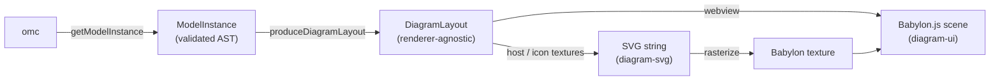
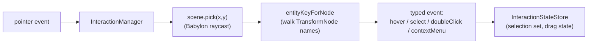

# Diagram rendering

[← back to README](../README.md) · related: [architecture.md](architecture.md) ·
[omc-client.md](omc-client.md)

How a Modelica class becomes pixels: `getModelInstance` → `DiagramLayout` →
Babylon scene (interactive) or SVG string (thumbnails).

## The pipeline

There are two renderers consuming the same `DiagramLayout`:

- **`diagram-ui`** (Babylon.js) — the interactive editor in the webview.
- **`diagram-svg`** (pure SVG) — library thumbnails (host-side) and the icon
  textures that `diagram-ui` paints onto component planes.

## Step 1 — `getModelInstance` → `ModelInstance`

One OMC call returns the whole elaborated class as JSON (wrapped in a Modelica
string). Inheritance is **already walked by OMC**, so the AST carries the host's
own members plus everything inherited, with annotations resolved. The client
validates it against a hand-rolled recursive Zod schema
([modelInstance.ts](../packages/omc-client/src/_shared/modelInstance.ts)) — see
[omc-client.md](omc-client.md) for why this is one structured call rather than
~30 round-trips.

## Step 2 — `produceDiagramLayout` (pure)

[producer.ts](../packages/omc-client/src/api/diagram/producer.ts) turns the AST
into the `DiagramLayout`. It makes **no OMC calls**. Its job:

1. Walk the host's `extends` chain to collect the host's **own** icon and diagram
   visuals, layered **ancestor-first** so later layers paint on top.
2. Walk the same chain for **standalone connectors** (ports on the host or any
   ancestor).
3. Walk the host's `elements` for **sub-components**, building a deduplicated
   **class catalog** keyed by `type.name` — each catalog entry has its own walked
   icon + connector list, so the same component type is rendered once and reused.
4. Emit **connections** that carry an `annotation.Line`; equation-only
   `connect(...)` calls with no annotation are skipped (they carry no diagram
   intent).
5. If `resolvedParameters` was supplied
   ([resolved-parameters.ts](../packages/omc-client/src/api/diagram/resolved-parameters.ts),
   from `getInstantiatedParametersAndValues`), use it to **gate conditional
   components/ports** (`Real x if use_x` etc.) and to resolve `%`-substitutions in
   value labels. Absent ⇒ everything defaults to visible.

The resulting `DiagramLayout` is described in
[protocol.md](protocol.md#the-diagramlayout-contract). Placement math
(extent → rotation → origin compose order, per Modelica spec §18) lives in
[placement.ts](../packages/omc-client/src/api/diagram/placement.ts).

## Step 3a — Babylon rendering (`diagram-ui`)

The webview renders the layout into a Babylon.js scene built from `<om-*>` Lit
elements.

### The element tree

| Element | Role |
| --- | --- |
| `<om-scene>` | **Root.** Owns the Babylon `Engine`/`Scene`, an orthographic camera for 2D (perspective for the MultiBody 3D mode), pan/zoom, and on-demand rendering. Provides scene + parent-node Lit contexts to descendants. |
| `<om-graphical-layout>` | **Orchestrator.** Takes the `DiagramLayout`, lays out components/connectors/connections, wires interaction and the parameter panel. |
| `<om-component>` | One sub-component, drawn as a textured plane; provides `%name`/`%class`/`%<param>` substitution context to its icon. |
| `<om-connector>` | A connector port with its visual indicator. |
| `<om-connection>` / `<om-edge>` | Connection wires (orthogonally routed). |
| `<om-label>` | Text labels (component names, value readouts). |
| `<om-rectangle>` `<om-polygon>` `<om-line>` `<om-ellipse>` `<om-text>` `<om-bitmap>` | The six shape primitives. |
| `<om-icon-provider>` | SVG → Babylon texture cache for component icons. |
| `<om-grid-axis>` | Grid + coordinate-system extent rectangle. |
| `<om-parameter-panel>` / `<om-parameter-form>` | The parameter side drawer (see [parameter-panel.md](parameter-panel.md)). |
| `<om-library-browser>` | Class picker for drag-to-place. |

### Drawing a component's icon

`<om-component>` renders its `IconLayer[]` in source order (ancestor-first,
host-last). Each shape becomes a primitive element which builds Babylon meshes:
filled quads/strokes for rectangles, polylines for lines, etc. Component icons
that come in as SVG are rasterized to a texture and painted on a plane — the
texture is cached by SVG hash and shared across all instances of the same class.

### Picking and selection

Interaction is mouse-driven via raycasting:

Each shape owns a transparent **hit plane** (alpha 0) used both for picking and
for the selection-outline highlight. The entity key encodes whether a node is a
component or a connector and its instance/port id — that key is what flows back to
the host in `change` / `selectionChange` / `editComponent` messages.

### State ownership

`diagram-ui` holds only *view* state — selection, pan/zoom, the icon cache. The
**model** state (the `DiagramLayout`) is owned by the host and pushed in as a
property; layout-op helpers (`applyDeltaMove`, `applyComponentExtent`,
`applyRotate`, `applyDelete`, …) return *new* layout objects, and the host decides
whether to commit them (and snapshot for undo). There is no undo logic in the
webview — see the [persistence/undo model](architecture.md#persistence--undo-model).

## Step 3b — SVG rendering (`diagram-svg`)

[diagram-svg](../packages/diagram-svg) is a pure function:
`renderIconLayersToSvg(layers, options)` → a complete, self-contained `<svg>`
string. It renders the same six primitives as SVG elements:

| Primitive | SVG | Notes |
| --- | --- | --- |
| Line | `<polyline>` | stroke + optional dashes |
| Polygon | `<polygon>` | filled + stroked |
| Rectangle | `<rect>` | optional rounded corners |
| Ellipse | `<ellipse>` | bounding ellipse |
| Text | `<text>` | font/alignment; matrix transform to stay upright in the y-flipped space |
| Bitmap | `<image>` | base64 PNG or file path |

Modelica's +Y-up coordinate system is handled by a root `<g transform="scale(1,-1)">`
flip; text and bitmaps get a counter-transform so glyphs stay upright. Cylinder
and sphere fills are emitted as gradient `<defs>`. Stroke widths are scaled by a
`lineThicknessScale` factor (spec thicknesses are tiny).

It is used:

- **Host-side** for library thumbnails — the host renders the icon-only
  annotation (cheap `getModelInstanceAnnotation`) to an SVG string and returns it
  via `libraryIconResult` (see [protocol.md](protocol.md#library-requestresponse-correlation)).
- **In the webview** as the source for component icon textures, which
  `<om-icon-provider>` rasterizes and caches.

## Related

- The 2D scene is shared with the planned **MultiBody 3D preview** — see
  [multibody-preview-design.md](multibody-preview-design.md).
- The data model and validation behind step 1/2:
  [omc-client.md](omc-client.md).
