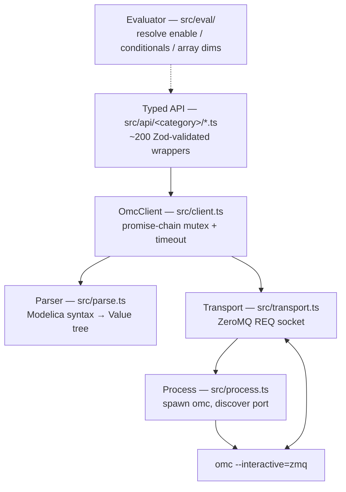

# OMC client internals

[← back to README](../README.md) · related: [architecture.md](architecture.md) ·
[diagram-rendering.md](diagram-rendering.md)

[`@modelica-wrapper/omc-client`](../packages/omc-client) is the standalone,
VSCode-free TypeScript client for OpenModelica's interactive ZeroMQ scripting API.
It is the only layer that talks to `omc`. This doc covers its internals:
transport, the response parser, the expression evaluator, the typed API surface,
validation, and version pinning.

## Layer map



## Transport & process

### Spawning `omc` and discovering its port

[process.ts](../packages/omc-client/src/process.ts) — `spawnOmc(omcPath, signal?)`
launches `omc --interactive=zmq -z=<suffix>`. The endpoint
(`tcp://127.0.0.1:<port>`) is discovered **deterministically**, no probing:

- A private temp dir is created per spawn (`mkdtemp(.../mw-omc-…)`).
- Environment is constrained so OMC writes its port file at a known path:
  - Unix: `TMPDIR=<tempdir>`, `USER=mw` ⇒ `${TMPDIR}/openmodelica.mw.port.<suffix>`
  - Windows: `TMP`/`TEMP=<tempdir>` ⇒ `${tempdir}/openmodelica.port.<suffix>`
- `suffix` is random (`mw_<hex>`), so concurrent clients never collide.
- `waitForPortFile()` polls every 50 ms (≤30 s) and returns the endpoint.

`stop()` kills the child and removes the temp dir.

### The request loop

[transport.ts](../packages/omc-client/src/transport.ts) holds one ZeroMQ
**REQ** socket connected to the endpoint (`linger = 200 ms` so shutdown doesn't
hang). `send(cmd, timeoutMs)` is just:

```ts
await sock.send(cmd);              // raw Modelica command string
const [reply] = await sock.receive();
return reply.toString("utf8");
```

REQ/REP guarantees strict send→receive ordering. On top of that
[client.ts](../packages/omc-client/src/client.ts) serializes every call through a
**promise-chain mutex** (OMC is single-threaded — overlapping calls would
interleave on the socket) and races each against a timeout (default 60 s). It
records `_lastCall` before sending so timeouts/errors report which command was in
flight.

### The wire format

OMC speaks **Modelica syntax**, not JSON. A request is a raw function call string
(`getVersion()`, `getComponentModifierValue(M.c, k)`); a response is a Modelica
expression:

```
"foo"                      → string
Modelica.Blocks.Math.Sin   → ident
true / false               → bool
42 / 1.5                   → int / float
{a, b, c}                  → list
Polygon(true, {0,0}, …)    → call
-                          → null  (bare dash between commas)
```

## Parser — Modelica syntax → `Value` tree

[parse.ts](../packages/omc-client/src/parse.ts) is a recursive-descent parser
producing a tagged-union `Value`:

```ts
type Value =
  | { kind: "string"; value: string }
  | { kind: "bool";   value: boolean }
  | { kind: "int";    value: number }
  | { kind: "float";  value: number }
  | { kind: "ident";  name: string }
  | { kind: "list";   items: Value[] }
  | { kind: "call";   name: string; args: Value[] }
  | { kind: "kwarg";  name: string; value: Value }
  | { kind: "null" };
```

- `parse(src)` — strict; fails on trailing input.
- `parseLeading(src)` — tolerant; returns `{ value, trailing }` for responses with
  trailing diagnostics.
- Coercion helpers: `asString/asBool/asInt/asFloat/asList/asStringList`
  (return `undefined` on mismatch) and strict `expectString/…` (throw).

This is deliberately **not** the positional string-splitting that OMEdit's
`StringHandler::getStrings()` does — that approach is the single biggest source of
inherited annotation bugs. Argument order comes from the Modelica spec (§18.6 for
shapes), not from probing OMC.

## Evaluator — resolving expressions

[src/eval/](../packages/omc-client/src/eval) evaluates Modelica expressions that
can't be read as plain literals:

- `Dialog(enable=…)` conditions (drives parameter-form gating)
- conditional declarations (`Real x if use_x;`)
- array-dimension expressions

`evaluateExpression(expr, scope, options)` walks the expression AST — component
refs, binary/unary ops, if-expressions, function calls — against an `EvalScope`
that looks up values. Unresolved refs return `undefined`, and the caller picks a
fallback (e.g. `true` for `enable`). Scope combinators (`chainScopes`,
`prefixStrippingScope`, `recordScope`) compose lookups; `prefixStrippingScope` is
what consumes the `crefPrefix` from the parameter panel.

## Typed API

~200 wrappers under `src/api/<category>/`, in 11 categories:

| Category | Covers |
| --- | --- |
| `browsing` | class existence, metadata, inheritance tree, predicates |
| `contents` | components, connections, **`getModelInstance`**, units (`getDerivedUnits`, `convertUnits`) |
| `diagram` | the `produceDiagramLayout` producer + placement/shape helpers (pure) |
| `editing` | `addComponent`, `deleteComponent`, `updateComponent`, `addConnection`, `deleteConnection`, `updateConnection`, `updateConnectionNames` |
| `elements` | modern generalized element access — `setElementModifierValue`, `removeElementModifiers`, `setElementAnnotation` |
| `execution` | `checkModel`, `simulate`, `getSimulationOptions`, … |
| `library` | load/search, package-manager (several network-gated) |
| `lifecycle` | `loadFile`, `loadString`, `listFile`, `getSourceFile`, `newModel`, … |
| `parameters` | component & extends modifiers (`get/setComponentModifierValue`, `get/setExtendsModifierValue`, derived-class readers) |
| `results` | reading `.mat`/CSV results |
| `solver` | solver/jacobian/tearing method getters & setters |

### Every wrapper has the same shape

Each function module exports a uniform set, so the registry can drive generic
dispatch and MCP-style help:

```ts
export const fooInputSchema  = z.object({ … });   // Zod input
export type   FooInput       = z.input<typeof fooInputSchema>;
export const fooOutputSchema = z.object({ … });   // Zod output
export type   FooOutput      = z.infer<typeof fooOutputSchema>;
export const fooDescription  = "…";               // OMC-docs-sourced
export async function foo(ctx: CallContext, input: FooInput): Promise<FooOutput> { … }
```

There is also a generic dispatcher (`REGISTRY`, `invoke(fn, input)`) and the
namespaced functional API (`browsing.*`, `contents.*`, … exported from
[index.ts](../packages/omc-client/src/index.ts)).

### The model-instance read path

`getModelInstance(className, modifier="", prettyPrint=false)` returns the whole
elaborated class as JSON wrapped in a Modelica string. The wrapper unwraps and
validates it against `ModelInstanceSchema`
([modelInstance.ts](../packages/omc-client/src/_shared/modelInstance.ts)) — a
hand-rolled recursive Zod schema (discriminated unions on `$kind`, `z.lazy` for
recursion, `.passthrough()` for forward-compat with OMC schema drift). This single
call replaces the ~30 round-trips an OMEdit-style read would make; inheritance is
pre-walked by OMC. It is the read half of the
[diagram pipeline](diagram-rendering.md).

## Validation

Every wrapper runs its OMC response through `parseOutput(schema, data, cmd)`
([\_shared/parseOutput.ts](../packages/omc-client/src/_shared/parseOutput.ts)),
which `safeParse`s against the Zod schema and throws a readable
`OMC response shape mismatch for <cmd>` if OMC drifts. Mutators additionally
normalise OMC's inconsistent success encodings (sometimes `true`/`false`,
sometimes `null`, sometimes an error string) into a uniform
`{ success, diagnostic? }`. Shared schemas live in
[\_shared/](../packages/omc-client/src/_shared).

## Version pinning

[version.ts](../packages/omc-client/src/version.ts):

```ts
export const SUPPORTED_OMC = {
  primary: "1.26.7",                       // verified pin
  compatibleMinor: { major: 1, minor: 26 }, // same major.minor ⇒ no warning
  auditedOn: "2026-05-20",                  // last full per-function audit
};
```

`parseOmcVersion()` extracts `major.minor.patch` from OMC's banner;
`compatibilityReport()` classifies the runtime as `exact` / `minor-compatible` /
`untested` / `unparseable`, surfaced via `OmcClient.getVersionStatus()`. The pin
is mirrored in the Dockerfile and CI workflow and kept in lock-step by Renovate
(see the [README](../README.md#renovate)).

## Coverage & audit

The wrappers are tracked function-by-function against a real OMC:

- **[coverage.md](../packages/omc-client/docs/coverage.md)** — which wrappers are
  integration-verified, cheap-but-unverified (🟡), or broken on the pin (⛔, with
  reasons). A `coverage:recount` script (wired into CI) diffs the per-category
  counts against the filesystem and fails on drift. There's also a drift-probe
  test that re-checks every ⛔ wrapper on the current pin.
- **[audit.md](../packages/omc-client/docs/audit.md)** — the read-only runbook for
  re-auditing against upstream OMC docs when the pin is bumped, including the
  conventions every wrapper follows and the "Class X not found in scope" gotcha
  (§2.10: string args must be quoted, TypeName args are bare).
