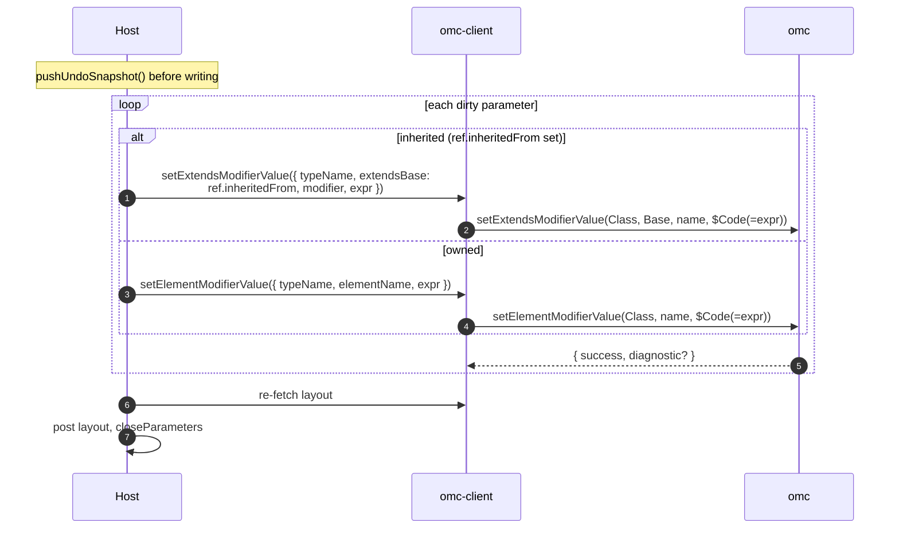
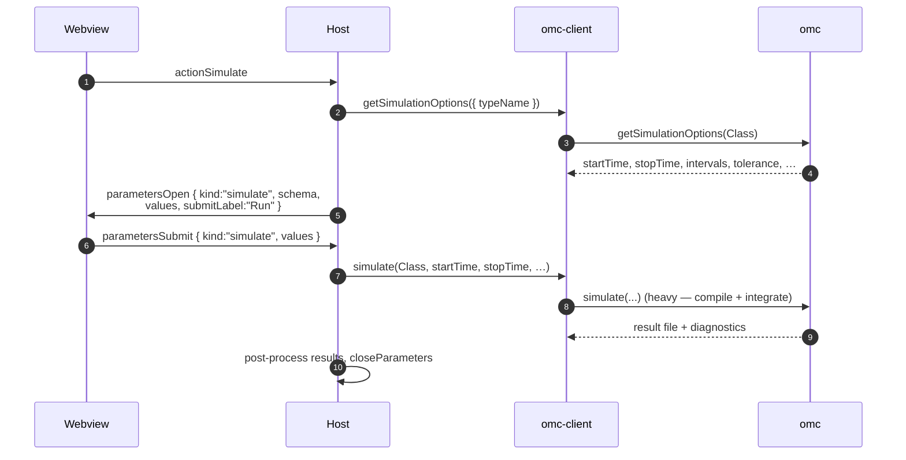
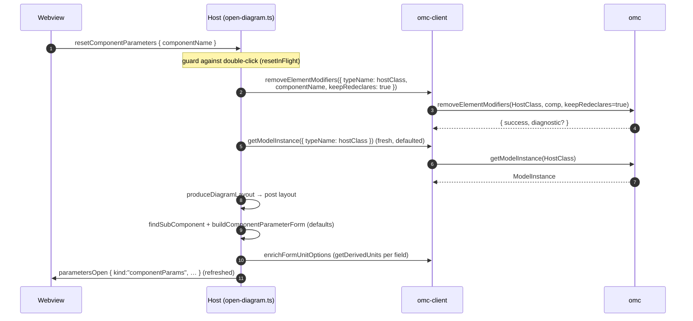

# Parameter panel — deep dive

[← back to README](../README.md) · related: [protocol.md](protocol.md) ·
[architecture.md](architecture.md)

This document traces, end to end, **exactly what happens when a parameter panel
is rendered and edited** — the information flow across all four layers and every
OMC scripting call made, in order. It covers the three panel `kind`s
(`componentParams`, `classParams`, `simulate`), live unit conversion,
`Dialog.enable`, and reset-to-defaults.

The panel itself is `<om-parameter-panel>` (a WebAwesome side drawer) wrapping
`<om-parameter-form>`
([parameter-form.component.ts](../packages/diagram-ui/src/parameter-form/parameter-form.component.ts)).
It is **schema-driven**: the host hands it a `JsonSchema` + an initial `values`
map, the form renders one row per field, and on submit it hands back a flat
`values` map. The form makes **no OMC calls and holds no model state** — it is a
pure function of (schema, values) plus local edit state.

## Cast of characters

| Layer | Component | File |
| --- | --- | --- |
| Webview UI | `<om-parameter-panel>` / `<om-parameter-form>` | [parameter-form/](../packages/diagram-ui/src/parameter-form) |
| Webview bridge | `<om-webview-root>` | [webview-entry.ts](../packages/extension/src/webview/webview-entry.ts) |
| Host — panel | `DiagramPanel.openParameters / closeParameters` | [panel.ts](../packages/extension/src/diagram/panel.ts) |
| Host — handlers | `onEditComponent`, `onParametersSubmit`, `onResetComponentParameters`, `onActionParameters`, `onActionSimulate` | [open-diagram.ts](../packages/extension/src/diagram/open-diagram.ts) |
| Host — form builders | `buildComponentParameterForm`, `buildClassParameterForm`, `buildSimulateForm` | [component-parameter-form.ts](../packages/extension/src/diagram/component-parameter-form.ts), [class-parameter-form.ts](../packages/extension/src/diagram/class-parameter-form.ts), [simulate-form.ts](../packages/extension/src/diagram/simulate-form.ts) |
| Host — unit enrichment | `enrichFormUnitOptions` | [unit-options.ts](../packages/extension/src/diagram/unit-options.ts) |
| Client | typed wrappers + evaluator | [omc-client](../packages/omc-client) |

## The `kind` tag routes everything

A single pair of messages (`parametersOpen` / `parametersSubmit`) serves all
three panels. The `kind` field discriminates how the host builds the form and how
it routes the submit:

| `kind` | Opened by | Submit writes via |
| --- | --- | --- |
| `componentParams` | double-click a sub-component (`editComponent`) | `setElementModifierValue` on `<component>.<param>` |
| `classParams` | toolbar Parameters (`actionParameters`) | `setElementModifierValue` (own params) / `setExtendsModifierValue` (inherited) |
| `simulate` | toolbar Simulate (`actionSimulate`) | `simulate(...)` — no model mutation |

---

## Flow A — component parameter panel (the main case)

### A1. Opening the panel

User double-clicks a component on the diagram. The full chain:

```mermaid
sequenceDiagram
    autonumber
    participant W as Webview (diagram-ui)
    participant H as Host (open-diagram.ts)
    participant C as omc-client
    participant O as omc

    W->>H: editComponent { componentName }
    H->>C: getModelInstance({ typeName: hostClass })
    C->>O: getModelInstance(HostClass)
    O-->>C: ModelInstance (JSON-in-string)
    C-->>H: validated instance
    H->>H: findSubComponent(instance, componentName)
    H->>H: buildComponentParameterForm(component)
    Note over H: walk the component type's extends chain,<br/>collect variability=="parameter" elements,<br/>read Dialog group/tab/enable annotations,<br/>prefer per-instance modifiers over type defaults
    H->>C: enrichFormUnitOptions(schema)
    loop each unit-bearing field
        C->>O: getDerivedUnits(baseUnit)
        O-->>C: derived units + scale/offset
    end
    C-->>H: schema with unit dropdown options
    H->>W: parametersOpen { kind:"componentParams", schema,<br/>values, title, crefPrefix: componentName }
    W->>W: render &lt;om-parameter-form&gt;
```

What each step contributes:

- **`getModelInstance`** ([getModelInstance.ts](../packages/omc-client/src/api/contents/getModelInstance.ts))
  returns the *whole* elaborated host class in one call — the sub-component, its
  type, its inherited members, current modifiers, and annotations — so the form
  builder needs no further round-trips to assemble the schema.
- **`buildComponentParameterForm`** walks the component type's `extends` chain,
  keeps elements with `variability == "parameter"`, reads each parameter's
  `Dialog(group=…, tab=…, enable=…)` annotation (drives grouping, tabs, and
  enable-gating), and resolves each field's current value — preferring a
  per-instance modifier over the type's default. It records, per field, a
  `ParameterRef` describing how to write it back; that ref set is held in the
  `openDiagram` closure for submit.
- **`enrichFormUnitOptions`** ([unit-options.ts](../packages/extension/src/diagram/unit-options.ts))
  is the only step that adds OMC calls per field: for each parameter that has a
  unit it calls **`getDerivedUnits(baseUnit)`** to populate the unit dropdown with
  the compatible display units and their affine conversion factors. These are
  baked into the schema so the webview can convert locally on every dropdown
  change — no per-keystroke OMC traffic.
- **`crefPrefix`** is the component instance name; the form's `Dialog.enable`
  evaluator strips it so cross-references inside the enable expression resolve.

### A2. What the form renders

Each schema field becomes one row
([parameter-fields.ts](../packages/diagram-ui/src/parameter-form/parameter-fields.ts)):

| Field kind | Widget |
| --- | --- |
| `string` | `<wa-input type="text">` |
| `number` / `integer` | `<wa-input type="number">` |
| `boolean` | `<wa-checkbox>` |
| `enum` | `<wa-select>` + `<wa-option>` |
| `array` | comma-separated `<wa-input type="text">` |
| `unsupported` | read-only `<span>` |

Plus, per field: an optional **unit widget** — a static suffix (e.g. `kg.m2`) or
a `<wa-select>` dropdown when `getDerivedUnits` returned alternatives. Dialog
`tab`/`group` annotations split the rows into `<wa-tab-group>` panels and labeled
groups. The footer has **Reset to defaults** (left, component panels only),
**Cancel**, and **Apply** (disabled while the form is incomplete).

### A3. Live unit conversion (no round-trip)

The conversion is affine and pre-computed, so changing the unit dropdown
re-displays the value instantly:

```
displayValue = (sourceValue - offset) / scaleFactor
```

with `scaleFactor`/`offset` from the `getDerivedUnits` result (the same affine
data `convertUnits` returns). On submit the form **back-converts** to the base
unit before handing values to the host
([unit-display.ts](../packages/diagram-ui/src/parameter-form/unit-display.ts)),
so the value written into the `.mo` is always in the declared base unit.

### A4. `Dialog.enable` gating

Each field carries its `enable` expression (from the `Dialog(enable=…)`
annotation). The form evaluates it against the *committed* working values
(updated on focus-out / `change`, not on every keystroke) using the client's
expression evaluator
([expression-evaluator.ts](../packages/omc-client/src/eval/expression-evaluator.ts)).
Unresolvable references fall back to **enabled** (`true`). Disabled fields render
dimmed and are **dropped from the submit payload** so a disabled value is never
written.

### A5. Editing and submitting

```mermaid
sequenceDiagram
    autonumber
    participant W as Webview (form)
    participant H as Host (open-diagram.ts)
    participant C as omc-client
    participant O as omc

    Note over W: user edits rows; on focus-out the form<br/>commits values + recomputes enable-gating
    W->>H: parametersSubmit { kind:"componentParams", values }
    H->>H: componentParameterEditPlan(refs, initial, submitted)<br/>→ only dirty, enabled fields
    loop each dirty field
        H->>H: elementName = "&lt;componentName&gt;.&lt;param&gt;"
        H->>H: expr = classParameterValueToExpr(ref, value)
        H->>C: getErrorString()  (drain stale diagnostics)
        H->>C: setElementModifierValue({ typeName: hostClass,<br/>elementName, expr })
        C->>O: setElementModifierValue(HostClass, comp.param, $Code(=expr))
        O-->>C: { success, diagnostic? }
        Note over H: log result to the REPL output channel
    end
    H->>C: re-fetch layout (getModelInstance →<br/>produceDiagramLayout → display units)
    C->>O: getModelInstance / convertUnits / …
    H->>W: layout   (diagram refreshes)
    H->>W: parametersClose
```

Key points:

- The host diffs `submitted` against the `initial` values it captured at open
  time (held in the closure as `componentParamInitialValues` +
  `componentParamRefs`), so only **changed** fields are written.
- Each write is a **`setElementModifierValue`**
  ([setElementModifierValue](../packages/omc-client/src/api/elements)) on the
  dotted element name `<componentName>.<param>`. The value is wrapped as
  `$Code(=<expr>)` by the wrapper to bypass string escaping; an empty expression
  removes the modifier (revert to default).
- After the batch, the host re-reads the layout (the full read flow from
  [architecture.md](architecture.md#read-flow-opening-a-diagram)) and posts a
  fresh `layout`, then closes the modal.

---

## Flow B — class parameter panel

Opened from the toolbar (`actionParameters`). Same shape as Flow A with two
differences:

1. **Form source** — `buildClassParameterForm(instance)` walks the *host class's*
   own extends chain and collects its top-level parameters (rather than a
   sub-component's). It records, per field, whether the parameter is **inherited**
   (`inheritedFrom = <base class>`) or owned.
2. **Submit routing** — depends on provenance:



Routing an inherited write through **`setExtendsModifierValue`** (and to the
*direct* extends base, even for multi-level inheritance) is what keeps the edit in
the right place in the source instead of incorrectly creating an own-modifier.
The class panel takes an undo snapshot before writing; it has no reset button.

---

## Flow C — simulate panel

Also a `parametersOpen`/`parametersSubmit` pair, but it mutates nothing:



`buildSimulateForm` seeds the form from **`getSimulationOptions`**; submit calls
the heavy **`simulate`** wrapper. No snapshot, no `setModifier` — the form is just
a typed front-end for the simulation options.

---

## Flow D — reset to defaults

The "Reset to defaults" button (component panels only) bulk-clears the
sub-component's modifiers and re-opens the panel showing the type defaults:



`removeElementModifiers` with **`keepRedeclares: true`**
([clear-modifiers.ts](../packages/extension/src/diagram/clear-modifiers.ts))
clears parameter values while preserving any `redeclare` type substitutions. The
host then refreshes both the diagram and the modal, and resets the closure's
`componentParamRefs`/`componentParamInitialValues` so the next submit diffs
against the new defaults.

---

## Summary — every OMC call the panel can make

| Step | OMC call | When |
| --- | --- | --- |
| Read model | `getModelInstance` | Every open + every refresh |
| Resolve label values | `getInstantiatedParametersAndValues` | During layout refresh |
| Populate unit dropdowns | `getDerivedUnits` | Per unit-bearing field, at open |
| Display-unit labels | `convertUnits` | During layout refresh |
| Drain diagnostics | `getErrorString` | Before each write |
| Write own / component param | `setElementModifierValue` | Per dirty field |
| Write inherited param | `setExtendsModifierValue` | Per dirty inherited field (class panel) |
| Reset to defaults | `removeElementModifiers` | Reset button |
| Simulate seed | `getSimulationOptions` | Open simulate panel |
| Simulate run | `simulate` | Submit simulate panel |

Everything the form does between open and submit — typing, switching units,
enable-gating, tab navigation — is **local to the webview**. OMC is touched only
to read the model, to fetch unit metadata once at open, and to write the
diff at submit.
