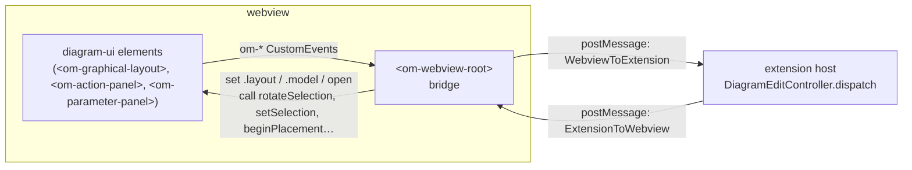
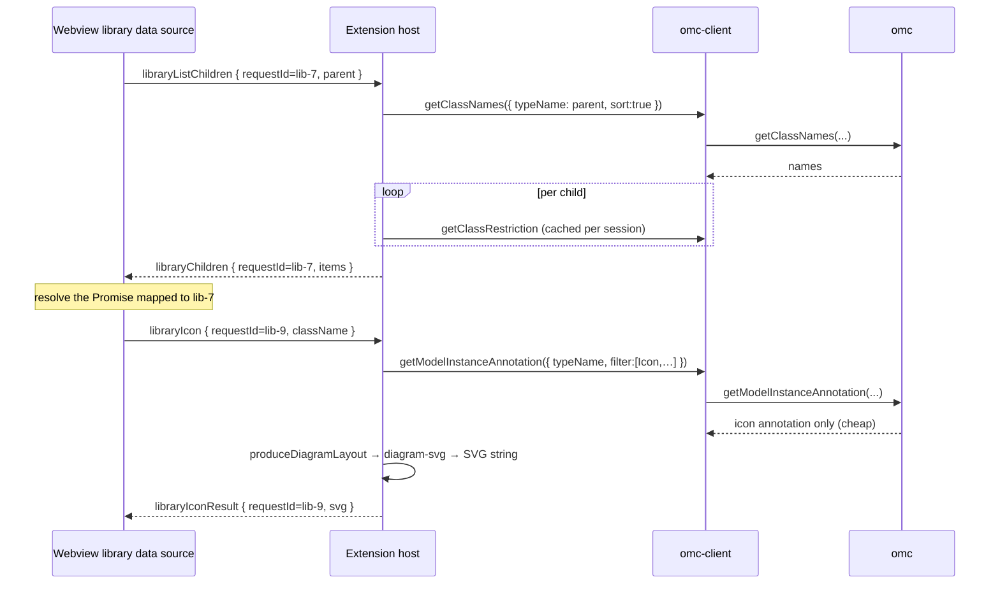
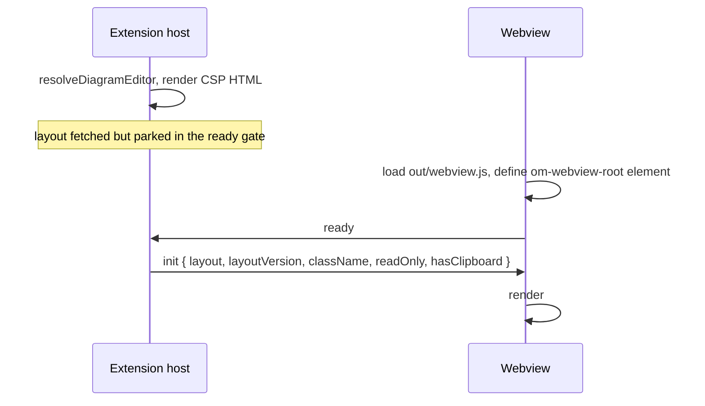

# Communication protocol

[← back to README](../README.md) · related: [architecture.md](architecture.md) ·
[parameter-panel.md](parameter-panel.md)

This is the reference for how the **diagram webview** and the extension host talk
to each other. There are two hops on this path:

1. **`diagram-ui` ↔ the webview bridge** — DOM `CustomEvent`s.
2. **The webview bridge ↔ the extension host** — `postMessage`, two typed tagged
   unions.

The bridge is `<om-webview-root>` in
[webview-entry.ts](../packages/extension/src/webview/webview-entry.ts); it is the
*only* place that calls `vscode.postMessage`. `diagram-ui` itself never touches
the VSCode API — it stays a pure renderer.

The library sidebar, the documentation editor and the postprocessing view are
separate webviews with protocols of their own
([library-view-protocol.ts](../packages/extension/src/webview/library-view-protocol.ts),
[documentation-protocol.ts](../packages/extension/src/webview/documentation-protocol.ts),
[postprocessing-protocol.ts](../packages/extension/src/webview/postprocessing-protocol.ts)).
Only the request/response idiom the library browser uses is described here, at
the bottom — the diagram protocol is fire-and-forget throughout.



## Hop 1 — DOM events (`diagram-ui` → bridge)

`diagram-ui` is host-agnostic. The bridge subscribes to these bubbling, composed
`CustomEvent`s. Some become a `postMessage`; the rest the bridge answers itself,
by calling back into `<om-graphical-layout>` or by updating its own state — a
rotate is a layout mutation the renderer already knows how to make, and it
reaches the host as the `change` the mutation commits.

| DOM event | Emitter | Bridge turns it into |
| --- | --- | --- |
| `om-graphical-layout-change` | `<om-graphical-layout>` | `change` (debounced by the [commit slot](../packages/extension/src/webview/commit-slot.ts)) |
| `om-connection-create` | `<om-graphical-layout>` | `connectionCreate` |
| `om-selection-change` | `<om-graphical-layout>` | `selectionChange` |
| `om-double-click` | `<om-graphical-layout>` | `editComponent` or `editShape`, by entity key; ignored for connectors, labels and empty canvas |
| `om-add-component-request` | `<om-graphical-layout>` | `addComponent` |
| `om-change-class-request` | `<om-graphical-layout>` | `changeClassRequest` |
| `om-clipboard-request` | `<om-graphical-layout>` | `copySelection` or `paste` |
| `om-go-to-source` | `<om-graphical-layout>` | `goToSource` |
| `om-tool-change` | `<om-graphical-layout>` | bridge state — mirrors the armed tool into the action panel |
| `om-action-check` | `<om-action-panel>` | `actionCheck` |
| `om-action-simulate` | `<om-action-panel>` | `actionSimulate` |
| `om-action-parameters` | `<om-action-panel>` | `actionParameters` |
| `om-action-rotate` | `<om-action-panel>` | `rotateSelection` on the layout |
| `om-action-flip` | `<om-action-panel>` | `flipSelection` on the layout |
| `om-action-tool` | `<om-action-panel>` | `setActiveTool` on the layout |
| `om-panel-submit` | `<om-parameter-panel>` | `parametersSubmit` |
| `om-panel-cancel` | `<om-parameter-panel>` | `parametersCancel` |
| `om-panel-reset` | `<om-parameter-panel>` | `resetComponentParameters` |

Two more messages have no `om-*` event behind them: `ready` is posted from the
bridge's `connectedCallback`, and `inputFocus` from the document's
`focusin`/`focusout`, so the host can gate the diagram's single-letter
keybindings while the user is typing.

In the other direction the bridge sets Lit properties (`.layout`, and on
`<om-parameter-panel>` the `.model`/`.heading`/`open`) or calls methods on
`<om-graphical-layout>` — it never dispatches events downward.

The detail type of every event above is in
[layout-events.ts](../packages/diagram-ui/src/graphical-layout/layout-events.ts)
(the layout's) and beside each component (the panels'). They are `CustomEvent`s
inside one browser context, so they carry no runtime validation; the validation
belongs to hop 2, which is a real process boundary.

## Hop 2 — the `postMessage` protocol

Two tagged unions, discriminated on `type`. All payloads are JSON-serialisable.

### Webview → extension host (`WebviewToExtension`)

Every inbound message is a **gesture**, and each gesture is declared exactly once
in [gestures.ts](../packages/extension/src/webview/gestures.ts) — its name, its
payload's field checks, how it orders against a queued layout commit, and
whether the icon editor acts on it. `WebviewToExtension` is derived from that
table, so there is no second place to add a variant and every gesture must
answer all four.

| `type` | Payload | Meaning |
| --- | --- | --- |
| `ready` | — | Webview finished loading; host sends the parked `init`. |
| `change` | `{ layout, basedOn }` | User committed a layout change (move/resize/rotate/draw/delete). The whole layout, not a diff. `basedOn` echoes the `layoutVersion` of the last `init`/`layout` push the webview applied; when it trails the host's current stamp, the report was computed without sight of a layout the class already holds — a push the webview refused (a gesture in flight, or a commit already queued), one the report crossed on the wire, or one the host withheld behind the report itself — and the host drops the edit kinds it can't trust from such a report (see `TRUSTED_ON_STALE_BASE` in `diff-layout.ts`) rather than reading them off `layout`'s difference from OMC's real state, then force-settles the webview onto what it missed. |
| `connectionCreate` | `{ fromKey, toKey, waypoints }` | User dragged from one connector to another. Empty `waypoints` ⇒ auto-route. |
| `selectionChange` | `{ keys }` | Selection set changed. |
| `inputFocus` | `{ focused }` | Keyboard focus entered/left an editable field; drives `modelicaDiagramInputFocus`. |
| `actionCheck` | — | Toolbar Check Model. |
| `actionSimulate` | — | Toolbar Simulate. |
| `actionParameters` | — | Toolbar class-level Parameters. |
| `editComponent` | `{ componentName }` | Double-click a sub-component → open its parameter modal. |
| `editShape` | `{ key }` | Double-click a shape → open its properties modal. |
| `parametersSubmit` | `{ kind, values, dirty }` | Parameter modal Apply/Run. `dirty` names the fields the user actually edited in this session — `shapeProperties` uses it to tell a deliberately-submitted default from an untouched field seeded with one; `classParams`/`componentParams`/`simulate` ignore it and diff/use `values` as before. |
| `parametersCancel` | `{ kind }` | Parameter modal dismissed. |
| `resetComponentParameters` | `{ componentName }` | "Reset to defaults" in the component modal. |
| `addComponent` | `{ className, position }` | Instantiate a class onto the canvas at `position`. Restriction-gated host-side, which is what lets the icon editor honor it — only a connector gets through. |
| `changeClassRequest` | `{ componentName, currentClass }` | Swap a sub-component's type. |
| `copySelection` | `{ keys }` | Copy — the host owns the window-wide clipboard and resolves the keys itself. |
| `goToSource` | `{ source, fallbackClassName }` | Open an entity's source in a text editor. `source` is the OMC-reported `SourceLocation` the webview already holds on the layout entity (the type's class for go-to-definition, the declaration for go-to-declaration); `fallbackClassName` names the class whose `modelica-source:` view opens when `source.filename` is not a real file on disk. |
| `paste` | — | Paste the host clipboard into this diagram. |

Each gesture's ordering and icon-mode answers live on its entry in
`gestures.ts` and are not repeated here — a second copy can only fall out of
sync. What the two axes mean:

**Ordering** is what the commit slot reads. A commit is debounced in the
webview, so anything that reads or writes the class has to wait behind a held
one; `selectionChange` in particular *must not* flush, because a drag reports
its selection on press and its commit on release.

**Icon mode** is what the icon editor's controller reads. It edits the class's
own icon annotation, so shape work, connector placement and the clipboard are
its business and the diagram's other gestures are no-ops there.

`kind` is a `ParameterFormKind` — `"classParams" | "componentParams" |
"shapeProperties" | "simulate"` — and stays that union all the way to the write:
a misspelled one is rejected at the boundary rather than routed nowhere.

### Extension host → webview (`ExtensionToWebview`)

| `type` | Payload | Meaning |
| --- | --- | --- |
| `init` | `{ layout, layoutVersion, className, readOnly, hasClipboard }` | Sent once after `ready`, to seed the webview. |
| `layout` | `{ layout, layoutVersion }` | Refreshed layout, re-read from OMC after a mutation, under a monotonic per-editor stamp. Dropped by the webview if a gesture or a held commit means it predates the screen — the drop is unacknowledged, and the host reads it off the `basedOn` the next `change` echoes. |
| `clipboard` | `{ hasClipboard }` | The window-wide clipboard filled or emptied; gates the paste affordance. Broadcast to every open editor. |
| `select` | `{ keys }` | Replace the selection — sent after a paste, so the fresh components are the ones under the next drag. |
| `error` | `{ message }` | Surface a backend error. |
| `renderError` | `{ className, mode, detail }` | The initial layout fetch failed; the webview replaces the canvas with a full error state. |
| `parametersOpen` | `{ kind, model, title, submitLabel?, crefPrefix? }` | Open the parameter modal on a `ParameterModel`. `kind` routes the eventual submit and gates read-only; `crefPrefix` is the sub-component instance name the `Dialog.enable` evaluator strips. |
| `parametersClose` | — | Dismiss the parameter modal. |
| `runCommand` | `{ commandId }` | A VSCode keybinding fired while the diagram panel was focused; the webview runs it through its own command registry. |
| `placementStart` | `{ className }` | A library row was dragged toward the canvas; arm the cursor-tracking ghost. |
| `placementPreview` | `{ className, classDef }` | The armed class resolved — upgrade the crosshair to the real preview node. |
| `placementCancel` | — | Disarm placement. |

### Both boundaries validate

`postMessage` hands over whatever the other side serialized, so an annotation on
the receiving parameter would only be a claim about it.

- Inbound, `isGestureMessage`
  ([gestures.ts](../packages/extension/src/webview/gestures.ts)) walks the
  declared field checks and narrows `unknown` to `WebviewToExtension`. A message
  that fails is logged with the field that failed and dropped.
- Outbound, `isExtensionMessage`
  ([protocol.ts](../packages/extension/src/webview/protocol.ts)) checks the
  discriminant against an exhaustive table of variants. The payload itself is
  trusted here: the host is the only sender and every send site is typed.
- Both dispatches end in `assertUnreachable`
  ([lang-core](../packages/lang-core/src/assert-unreachable.ts)), so a variant
  added without a handler is a compile error, and one that somehow arrives at
  runtime reports instead of returning quietly.

Inbound messages are dispatched in `DiagramEditController.dispatch`
([diagram-editor-provider.ts](../packages/extension/src/diagram/diagram-editor-provider.ts));
the webview's inbound handler is `<om-webview-root>`'s `apply()`.

## The `DiagramLayout` contract

Most messages carry a `DiagramLayout`
([diagramLayout.ts](../packages/omc-client/src/_shared/diagramLayout.ts)). It is
the renderer-agnostic shape both sides agree on:

```ts
interface DiagramLayout {
  kind: "icon" | "diagram";
  className: string;
  source: SourceLocation;
  coordinateSystem?: CoordinateSystem;
  iconLayers: IconLayer[];      // host's own visuals, ancestor-first
  diagramLayers: IconLayer[];
  labels: LabelLayout[];        // top-level Text shapes from the diagram annotation
  classes: Record<string, ClassDef>;          // per-type catalog (deduped by type name)
  components: Record<string, ComponentInstance>;   // keyed by instance name
  connectors: Record<string, ConnectorInstance>;
  connections: ConnectionLayout[];            // only those with annotation.Line
  resolvedParameters?: Record<string, string>; // name → value, for gating + label %-subst
}
```

It is produced host-side by `produceDiagramLayout`
([producer.ts](../packages/omc-client/src/api/diagram/producer.ts)) and never
constructed in the webview. The gesture boundary checks a `change` payload's
discriminant and class name rather than its whole interior: the host diffs it
field by field against a freshly-read layout before writing anything, so a
malformed one turns into edits OMC rejects, not a silent write.

## Library request/response correlation

The library browser is request/response over a fire-and-forget channel, so each
request carries a `requestId`. This runs over the sidebar webview's own protocol
([library-view-protocol.ts](../packages/extension/src/webview/library-view-protocol.ts)),
not the diagram's. The webview's data source mints ids (`"lib-1"`, `"lib-2"`, …),
stores `{resolve, reject}` in a `Map`, and drains the entry when the matching
response arrives.



Icons are fetched **lazily, per visible row** via `libraryIcon`, so enumerating a
large package never pays the icon-render cost up front. The host renders them with
the cheap `getModelInstanceAnnotation` filter (icon only, not the full instance)
and turns the result into an SVG with [`diagram-svg`](../packages/diagram-svg).

## Webview boot sequence



If a fresh layout is computed while the webview isn't ready yet, the
[ready gate](../packages/extension/src/webview/ready-gate.ts) parks it and
flushes it on `ready`; later refreshes go out as `layout`.
