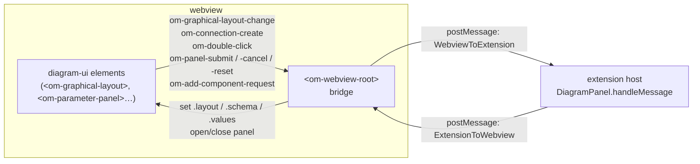
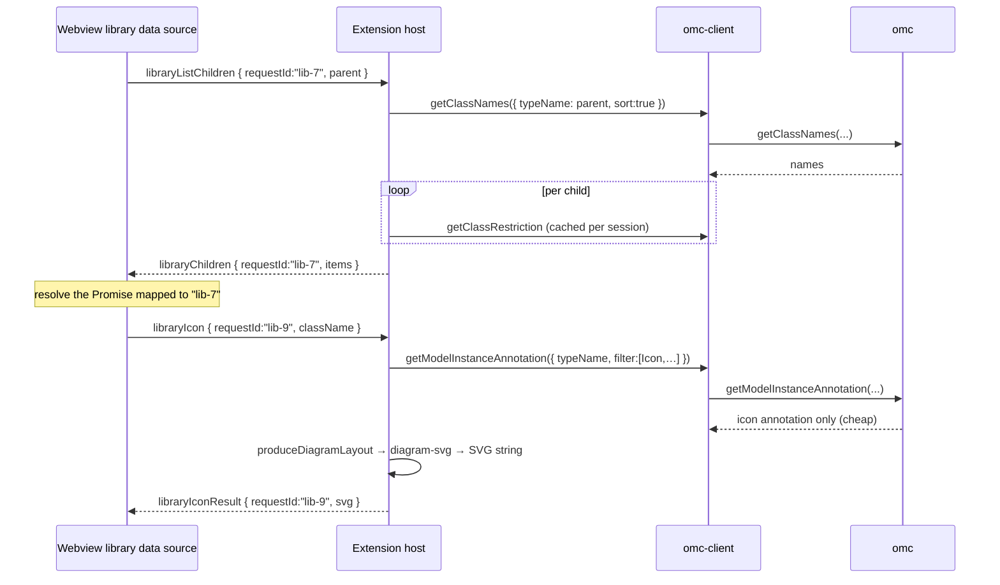

# Communication protocol

[← back to README](../README.md) · related: [architecture.md](architecture.md) ·
[parameter-panel.md](parameter-panel.md)

This is the complete reference for how the diagram webview and the extension host
talk to each other. There are two hops on this path:

1. **`diagram-ui` ↔ the webview bridge** — DOM `CustomEvent`s.
2. **The webview bridge ↔ the extension host** — `postMessage`, a typed tagged
   union.

The bridge is `<om-webview-root>` in
[webview-entry.ts](../packages/extension/src/webview/webview-entry.ts); it is the
*only* place that calls `vscode.postMessage`. `diagram-ui` itself never touches
the VSCode API — it stays a pure renderer.



## Hop 1 — DOM events (`diagram-ui` → bridge)

`diagram-ui` is host-agnostic. The bridge subscribes to these bubbling, composed
`CustomEvent`s and re-emits them as `postMessage`s
([webview-entry.ts](../packages/extension/src/webview/webview-entry.ts)):

| DOM event | Bridge turns it into |
| --- | --- |
| `om-graphical-layout-change` | `change` |
| `om-connection-create` | `connectionCreate` |
| `om-selection-change` | `selectionChange` |
| `om-double-click` (component keys only) | `editComponent` |
| `om-add-component-request` | `addComponent` |
| `om-panel-submit` | `parametersSubmit` |
| `om-panel-cancel` | `parametersCancel` |
| `om-panel-reset` | `resetComponentParameters` |

In the other direction the bridge sets Lit properties on the elements
(`.layout`, and on `<om-parameter-panel>` the `.schema`/`.values`/`open`) rather
than dispatching events.

## Hop 2 — the `postMessage` protocol

The wire contract is two TypeScript tagged unions in
[protocol.ts](../packages/extension/src/webview/protocol.ts), discriminated on
`type`. All payloads are JSON-serialisable.

### Extension host → webview (`ExtensionToWebview`)

| `type` | Payload | Meaning |
| --- | --- | --- |
| `init` | `{ layout: DiagramLayout, className }` | Sent once after the webview's `ready`, to seed it. |
| `layout` | `{ layout: DiagramLayout }` | Refreshed layout after a mutation was re-read from OMC. |
| `error` | `{ message }` | Surface a backend error in the webview UI. |
| `parametersOpen` | `{ kind, schema: JsonSchema, values, title, submitLabel?, crefPrefix? }` | Open the parameter modal. `kind` routes the eventual submit (`"simulate"`, `"classParams"`, `"componentParams"`). `crefPrefix` is the sub-component instance name, used by the `Dialog.enable` evaluator. |
| `parametersClose` | `{}` | Dismiss the parameter modal. |
| `libraryChildren` | `{ requestId, items?, error? }` | Response to `libraryListChildren`. |
| `librarySearchResult` | `{ requestId, items?, error? }` | Response to `librarySearch`. |
| `libraryIconResult` | `{ requestId, svg?, error? }` | Response to `libraryIcon` — a self-contained `<svg>` thumbnail. |

### Webview → extension host (`WebviewToExtension`)

| `type` | Payload | Meaning |
| --- | --- | --- |
| `ready` | `{}` | Webview finished loading; host sends the parked `init`. |
| `change` | `{ layout: DiagramLayout }` | User committed a layout change (move/resize/rotate/delete). |
| `connectionCreate` | `{ fromKey, toKey, waypoints }` | User dragged from one connector to another. Empty `waypoints` ⇒ auto-route. |
| `selectionChange` | `{ keys: string[] }` | Selection set changed. |
| `error` | `{ message }` | Diagnostic from the webview. |
| `actionUndo` | `{}` | Toolbar Undo. |
| `actionCheck` | `{}` | Toolbar Check Model. |
| `actionSimulate` | `{}` | Toolbar Simulate. |
| `actionParameters` | `{}` | Toolbar class-level Parameters. |
| `editComponent` | `{ componentName }` | Double-click a sub-component → open its parameter modal. |
| `parametersSubmit` | `{ kind, values }` | Parameter modal Apply/Run. |
| `parametersCancel` | `{ kind }` | Parameter modal dismissed. |
| `resetComponentParameters` | `{ componentName }` | "Reset to defaults" in the component modal. |
| `addComponent` | `{ className, position }` | Instantiate a library class onto the canvas at `position`. |
| `libraryListChildren` | `{ requestId, parent }` | Enumerate child classes of `parent` (`null` = top-level). |
| `librarySearch` | `{ requestId, query }` | Substring search over loaded classes. |
| `libraryIcon` | `{ requestId, className }` | Lazy per-row icon thumbnail request. |

Inbound messages are dispatched in `DiagramPanel.handleMessage`
([panel.ts](../packages/extension/src/diagram/panel.ts)); the webview's inbound
handler lives in `<om-webview-root>`'s `apply()`.

## The `DiagramLayout` contract

Most messages carry a `DiagramLayout`
([diagramLayout.ts](../packages/omc-client/src/_shared/diagramLayout.ts)). It is
the renderer-agnostic shape both sides agree on:

```ts
interface DiagramLayout {
  kind: "icon" | "diagram";
  className: string;
  source: SourceLocation;
  coordinateSystem?: CoordinateSystem;
  iconLayers: IconLayer[];      // host's own visuals, ancestor-first
  diagramLayers: IconLayer[];
  labels: LabelLayout[];        // top-level Text shapes from the diagram annotation
  classes: Record<string, ClassDef>;          // per-type catalog (deduped by type name)
  components: Record<string, ComponentInstance>;   // keyed by instance name
  connectors: Record<string, ConnectorInstance>;
  connections: ConnectionLayout[];            // only those with annotation.Line
  resolvedParameters?: Record<string, string>; // name → value, for gating + label %-subst
}
```

It is produced host-side by `produceDiagramLayout`
([producer.ts](../packages/omc-client/src/api/diagram/producer.ts)) and never
constructed in the webview.

## Library request/response correlation

The library browser is request/response over a fire-and-forget channel, so each
request carries a `requestId`. The webview's data source mints ids
(`"lib-1"`, `"lib-2"`, …), stores `{resolve, reject}` in a `Map`, and drains the
entry when the matching response arrives.



Icons are fetched **lazily, per visible row** via `libraryIcon`, so enumerating a
large package never pays the icon-render cost up front. The host renders them with
the cheap `getModelInstanceAnnotation` filter (icon only, not the full instance)
and turns the result into an SVG with [`diagram-svg`](../packages/diagram-svg).

## Webview boot sequence

```mermaid
sequenceDiagram
    participant H as Extension host
    participant W as Webview

    H->>H: createWebviewPanel("modelicaDiagram"), render CSP HTML
    Note over H: layout ready but parked as pendingInit
    W->>W: load out/webview.js, define &lt;om-webview-root&gt;
    W->>H: ready
    H->>W: init { layout, className }
    W->>W: render
```

If a fresh layout is computed while the webview isn't ready yet, the host parks it
as `pendingInit` and flushes it on `ready`; later refreshes go out as `layout`.
